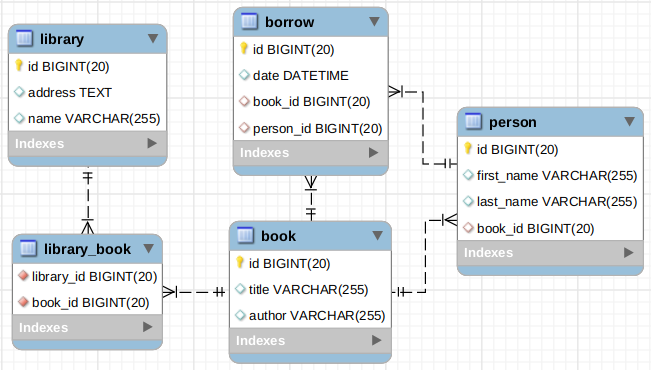

# CHECKPOINT 3

Le checkpoint est un moyen de t'autoévaluer, de te montrer de quoi tu es capable.

**Conseils :**

* ne reste pas bloqué, passe au point suivant, ou demande à ton formateur !
* la limite de temps existe, mais tu peux continuer à travailler plus tard si tu veux reprendre des choses à tête reposée
* terminé ou non, pense à tout commiter et pousser

## I. Récupération et initialisation du projet

### 1. Dépôt local

Clone le contenu de ce dépôt en local. **Ne fait pas de Fork !**

Dans ton dépôt local, crée une branche ayant le format suivant : la ville de ton cursus en minuscule, ton prénom et nom sans accents ni espaces, séparés par des tirets, avec le nom en majuscule. Exemple : pour **Éloïse Durant**, crée une branche **lyon-eloise-DURANT**.

**Passe sur cette branche pour la suite du *checkpoint* !**

> Conseil : ajoute et envoie tes modifications en local après chaque exercice, pour éviter les mauvaises surprises

## II. Quiz

Tu trouveras un fichier `Quiz.java` à la racine de ton dépôt local : compile et exécute le.

Réponds aux questions, cela va générer un fichier `quiz.txt`.

Tu peux ensuite éditer le fichier manuellement pour corriger tes réponses.

> Merci de répondre honnêtement, sans t'aider d'Internet !

## III. Algorithme

Tu trouveras un package `src/main/java/algo` dans la racine de ton dépôt local, tu pourras y réaliser l'algorithme suivant :

### 1. Pac-Man

Tu veux développer un algorithme qui, avec une grille de Pac-Man en entrée et son numéro de niveau, te retourne le score maximal qu'il est possible d'atteindre.

Pour simplifier l'exercice, une grille de Pac-Man peut contenir dans chaque case un des quatre caractères suivants :

* ' ' : une case vide, ne vaut aucun point
* '.' : une pac-gomme, qui vaut 1 point
* 'o' : une super pac-gomme, qui vaut 10 points
* 'x' : un fruit, qui vaut 100 points multiplié par le numéro du niveau

Ex:

```
grid: {
    {'o', '.', '.'},
    {' ', 'x', ' '},
    {'.', '.', 'o'}
}
level: 2
```

Pour calculer le score, il faudra additionner :

* 4 pac-gommes (4)
* 2 super pac-gommes (20)
* 1 fruit (200, car on est au second niveau)

Soit un total de 224 !

#### Pour tester

``` bash
./tester.sh PacMan
```

### 2. Le chiffre de Vigenère

Le chiffre de Vigenère est une amélioration du chiffre de César, donc l'idée fondamentale est de ne pas appliquer le même décalage à chaque lettre.

Dans cet exercice, on se propose de faire une méthode de classe qui chiffre une chaine de caractère avec l'algorithme de Vigenère. Cette méthode de classe prend en paramètre la chaîne à chiffrer ainsi qu'un tableau d'entiers contenant les décalages qui seront successivement appliqués. Lorsqu'on atteint le dernier décalage du tableau, on revient au premier.

On part de l'hypothèse suivante : la chaîne de caractères à chiffrer ne contient que des lettres minuscules et des espaces. Les espaces ne seront pas modifiés et apparaîtront tel quel dans le message chiffré.

**Ex :**

``` java
int[] key = {0, 1, 2, 3, 4};
System.out.print(vigenere("a secret to everybody", key));
// a uhgrfv xo gyirzdrhy
```

**Soit :**

* a + 0 = a
* espace + 1 = espace (pas de modification)
* s + 2 = u
* e + 3 = h
* c + 4 = g
* r + 0 = r (on revient à 0)
* e + 1 = f
* etc...

> Remarque : on peut déchiffrer avec le même algorithme en calculant une clé complémentaire qui inverse l'effet de la première. Par exemple la clé pour déchiffrer {1, 0, 15} est {25, 0, 11}

#### Pour tester

``` bash
./tester.sh Cypher
```

## IV. Spring Boot

#### 1. Modélisation

Une amie bibliothécaire te propose de créer un site internet qui lui permettrait de renseigner les livres et les adhérents de sa bibliothèque. Après discussion, vous avez réalisé en commun la modélisation suivante :



* une bibliothèque (`library`) est caractérisée par son nom (`name`) et son adresse (`address`)
* un livre (`book`) est caractérisé par son titre (`title`) et son auteur (`author`)
* une bibliothèque peut proposer plusieurs livres et un même livre peut être proposé par plusieurs bibliothèques
* un adhérent (`person`) est caractérisé par un prénom (`first_name`), un nom (`last_name`) et possède un livre préféré (`book_id`)
* un adhérent peut emprunter (`borrow`) un ou plusieurs livre, à une date (`date`) donnée

Afin de rapidement créer un prototype, ta mission est de créer la base de données correspondante à la modélisation à l'aide de `Spring Data JPA`.

#### 2. Formulaires

Tu possèdes déjà des formulaires permettant d'afficher la liste de tous les livres. Tu possèdes aussi un formulaire de création/édition d'un livre.

Cependant, tu n'as pas de controlleur et ses routes nécessaire à l'utilisation de ces formulaires :

* crée un controleur `BookController`
* crée une route `/book` qui permet d'afficher le formulaire de création d'un livre : `book.html`
* crée une route `/save` qui permet d'ajouter un nouveau livre à la base de données
* modifie le template `book.html` pour gérer l'ajout d'un livre à la base de données
* crée une route `/books` qui permet d'afficher la liste des livres : `books.html`
* modifie le template `books.html` afin d'afficher tous livres de la base de données

#### 3. Recherche

La dernière étape du prototype est de créer un formulaire de recherche.

Dans `BookController` :
* crée la route `/search` permettant d'afficher le formulaire de recherche : `search.html`

Ensuite, crée les deux routes suivantes :

* `/search-title` : retourne un *JSON* contenant un seul livre, dont le titre est celui fourni par le formulaire.
* `/search-author` : retourne un *JSON* contenant une liste de livres, dont l'auteur est celui fourni par le formulaire.

Ces deux routes devront utiliser des méthodes préalablement ajoutées au *reposity*.

## V. Finalisation

Envoie les modifications de ta branche locale et pousse ces modifications sur le dépôt distant.

Dans GitHub, vérifie que la branche existe et que tes modifications sont bien présentes.

Tu peux revenir dans Odyssey et partager le lien vers ta branche sur GitHub.
